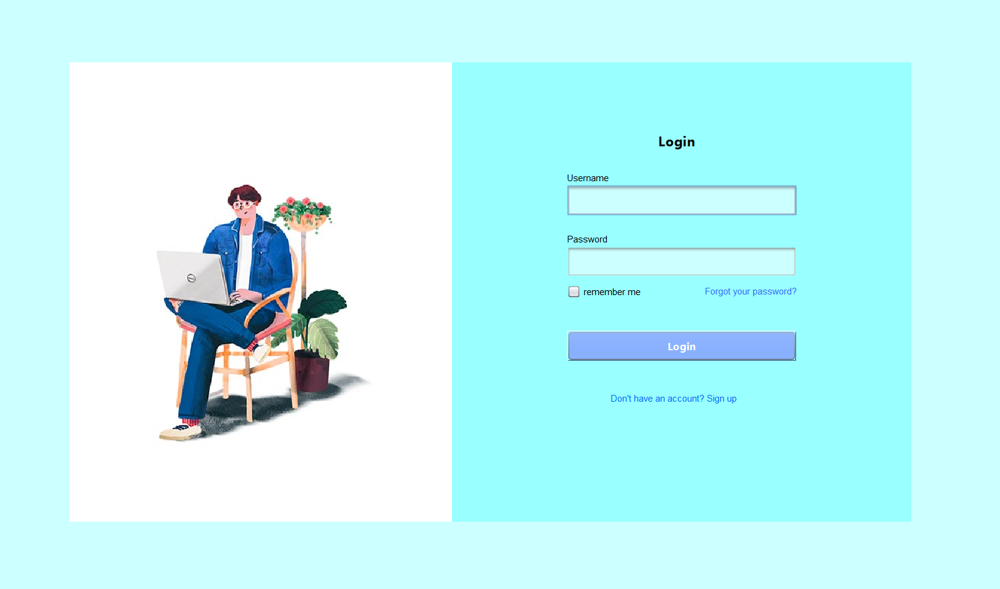
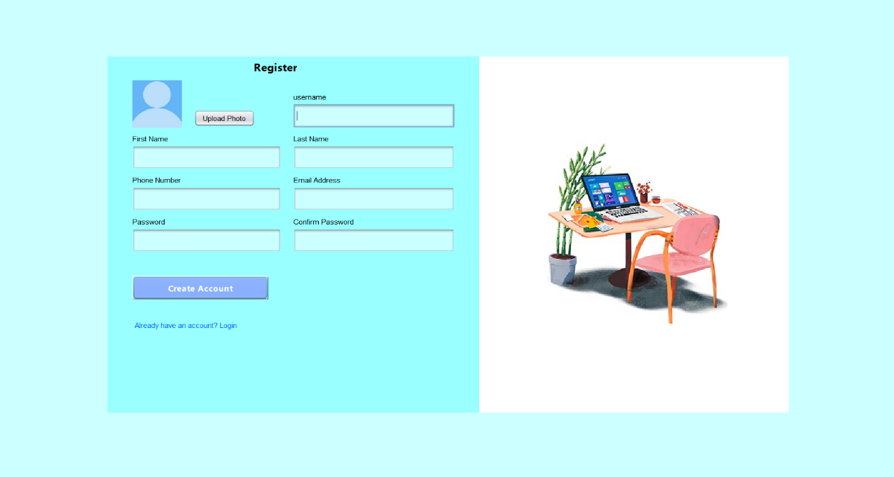
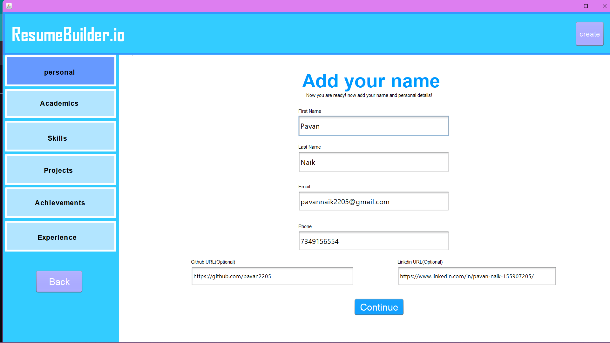
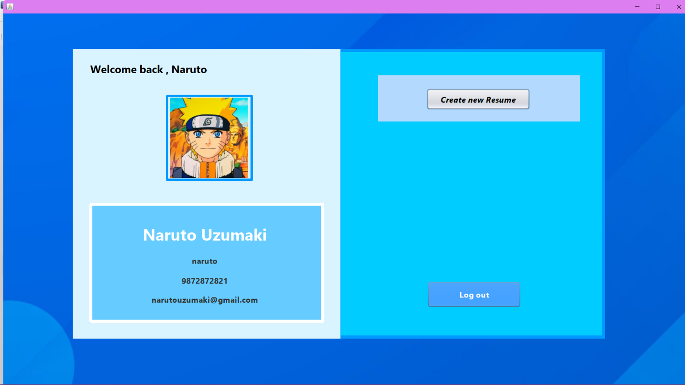
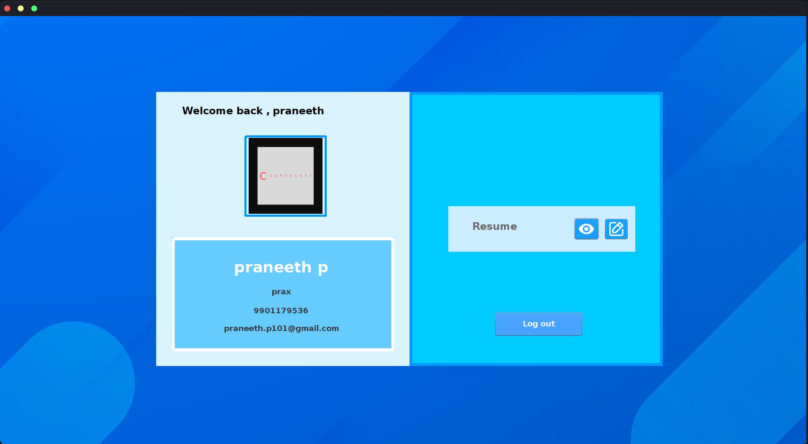
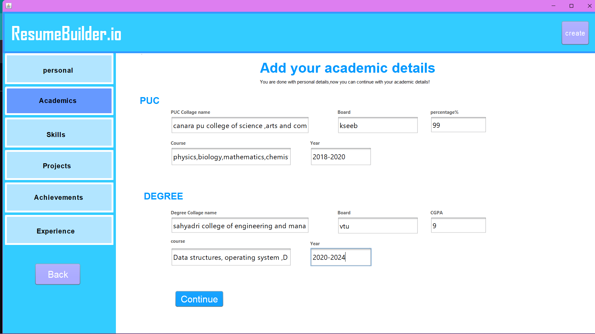
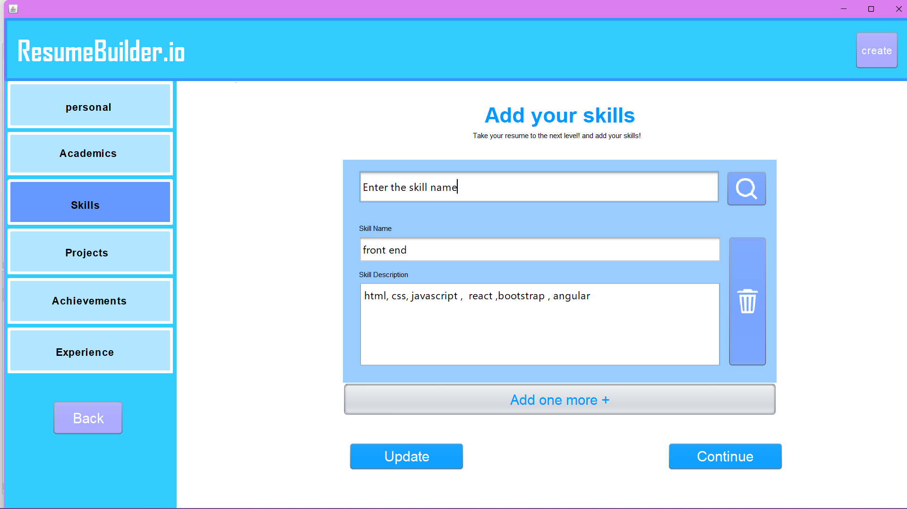
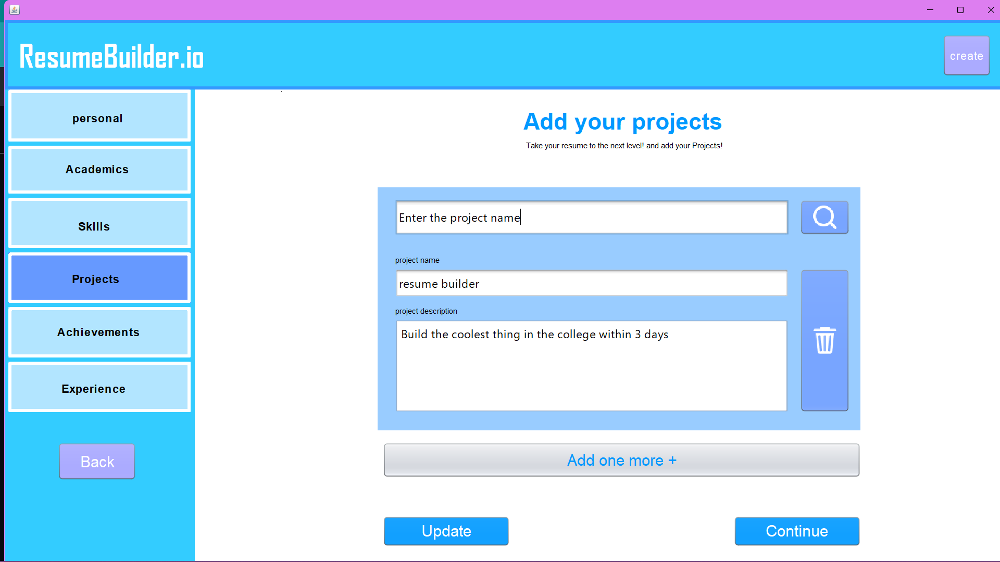
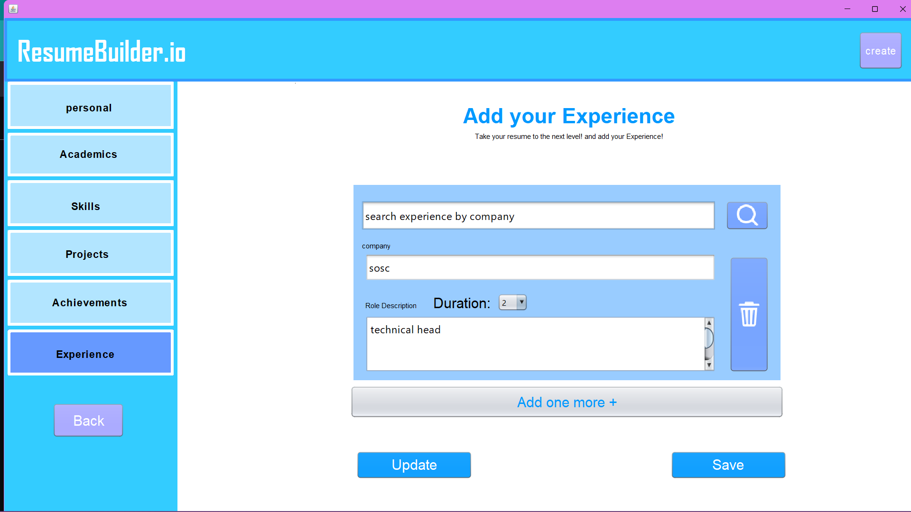
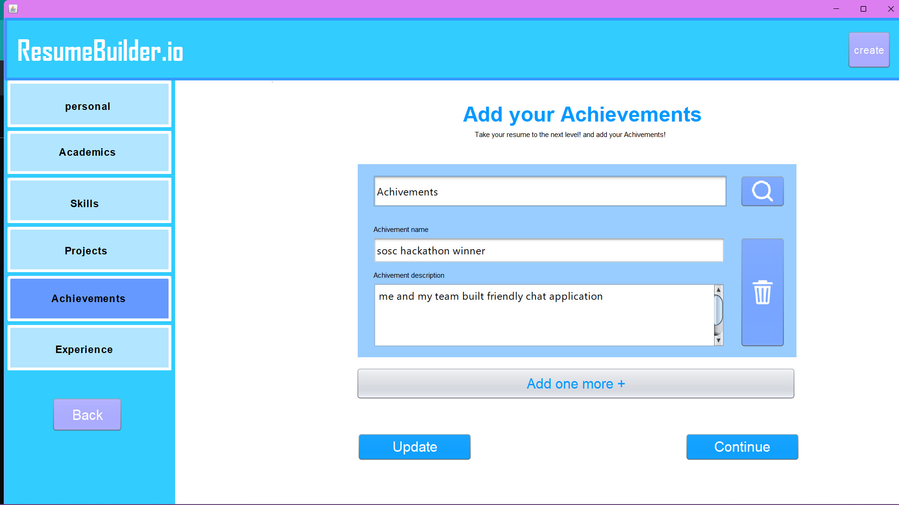

# Resume Builder

## Overview

Resume Builder is a software tool designed to assist individuals in creating professional and effective resumes. It provides a user-friendly interface and a set of features aimed at helping job seekers craft polished and personalized resumes.

## Features

- **Templates and Layouts**: Offers a selection of pre-designed templates and layouts to choose from, enabling users to create visually appealing resumes.
  
- **Customization Options**: Provides editing and formatting features that allow users to customize their resumes according to their preferences and personal style.

- **User-Friendly Interface**: Presents a simple and intuitive interface, making it easy for job seekers to navigate and use the tool effectively.

- **Resume Tracking and Analytics**: Provides features for tracking the status of submitted resumes and analyzing their effectiveness in securing interviews or job offers.

## Usage

To use the Resume Builder:

1. **Select a Template**: Choose a template or layout that best suits your professional profile and industry.

2. **Enter Personal Information**: Fill in your personal details, including contact information, work experience, education, and skills.

3. **Customize Content**: Tailor the content of your resume to highlight your unique qualifications and achievements.

4. **Preview and Edit**: Review the resume layout and content, making any necessary edits or adjustments.

5. **Export or Print**: Save the completed resume in a preferred format (e.g., PDF, Word) or print it directly for submission.

## Images

Below are the images illustrating the usage of the Resume Builder:

1. 
2. 
3. 
4. 
5. 
6. 
7. 
8. 
9. 
10. 
11. 
   (and so on...)

## Conclusion

The Resume Builder offers a convenient and flexible solution for job seekers looking to create compelling resumes. With its user-friendly interface and robust functionality, this tool empowers individuals to present themselves effectively in the competitive job market, helping them stand out and secure meaningful employment opportunities.
